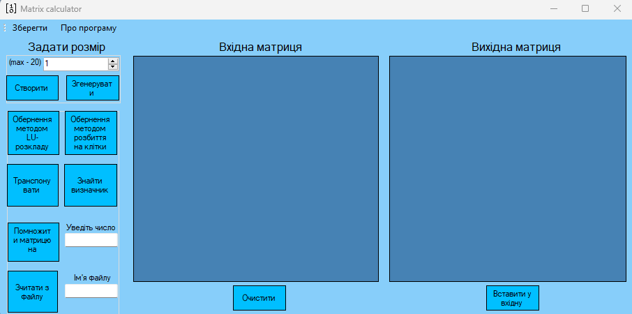
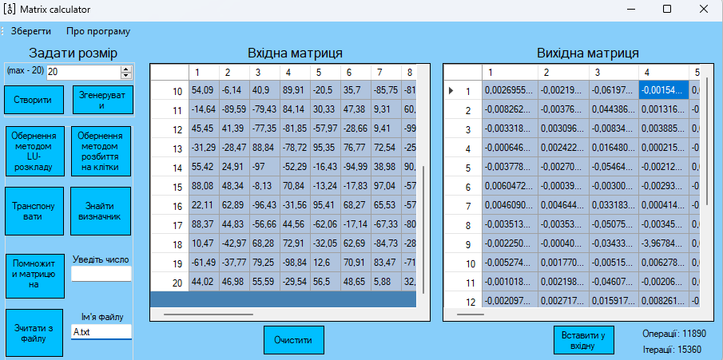

# Matrix-Calcurator
Desktop matrix calculator, based on _Blockwise inversion_ and _LU-decomposition_ algorithms. 

## Main functions
With this app, you can:
 - Transpose matrices
 - Find a determinant
 - Do Blockwise inversion
 - Do LU-inversion
 - Multiply matrix by a constant

##  Work with files
In addition to the possibility of manual entry, you can also read the matrix from the file. There is also a function to **save the results** of operations to a file in text format

## Time complexity
 You can view information about the number of **iterations** and **elementary operations** performed for the selected algorithm.  

 **Asymptotic complexity** of the algorithms:
 - LU-inverse - _O(n^3)_
 - Blockwise - _O(n^2 * lg(n))_